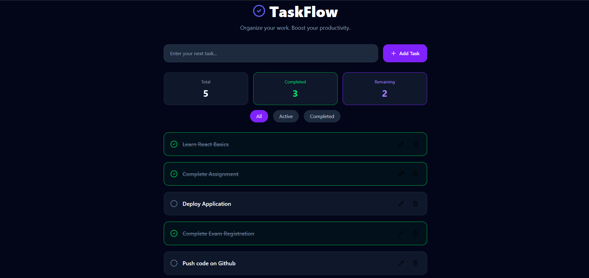

# To-Do List Web App

TaskFlow - A responsive To-Do List Web Application built using **React**, **Vite**, **Tailwind CSS**.

The application allows users to efficiently manage daily tasks with a clean UI and persistent local storage.

---

## Screenshots

### UI Demo



---

## Features

- Add New Tasks
- Edit Existing Tasks
- Delete Tasks
- Mark Tasks as Complete / Incomplete
- Filter Tasks (All / Active / Completed)
- Live Task Statistics
- Local Storage Support
- Fully Responsive Design

---

## Technologies Used

- React.js
- Vite
- Tailwind CSS
- Framer Motion
- Lucide React Icons

---

## Folder Structure

```text
To-Do List Web App/
│
├── public/
│
├── src/
│   ├── assets/
│   ├── components/
│   ├── App.jsx
│   ├── main.jsx
│   └── index.css
│
├── package.json

```

---

## Installation

Clone the repository

Navigate to the project

```bash
cd To-Do-List-Web-App
```

Install dependencies

```bash
npm install
```

Start development server

```bash
npm run dev
```

---

## Author

**Ridham Shah**